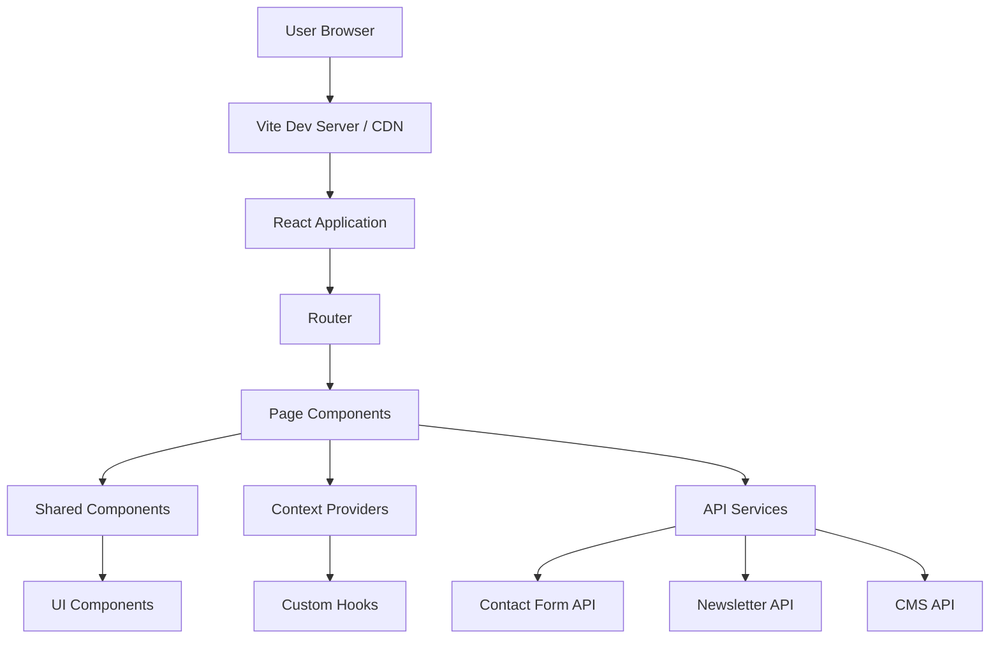

# Design Document: Silicon Nova Website

## Overview

The Silicon Nova website will be built as a modern, high-performance single-page application (SPA) using React 19 and Vite. The architecture prioritizes performance, maintainability, and user experience through component-based design, optimized asset delivery, and progressive enhancement. The website will feature a sleek, tech-inspired aesthetic with smooth animations, intuitive navigation, and responsive layouts that work seamlessly across all devices.

### Technology Stack
- **Frontend Framework:** React 19.1.1
- **Build Tool:** Vite 7.1.7
- **Styling:** CSS Modules with CSS Variables for theming
- **Routing:** React Router v6
- **State Management:** React Context API + Custom Hooks
- **Form Handling:** React Hook Form
- **Animations:** Framer Motion
- **Icons:** React Icons
- **Image Optimization:** Vite's built-in optimization + lazy loading
- **SEO:** React Helmet Async
- **Analytics:** Google Analytics 4 (via react-ga4)

## Architecture

### High-Level Architecture



### Application Structure

```
src/
├── components/
│   ├── layout/
│   │   ├── Header.jsx
│   │   ├── Footer.jsx
│   │   ├── Navigation.jsx
│   │   └── MobileMenu.jsx
│   ├── home/
│   │   ├── HeroSection.jsx
│   │   ├── ServicesOverview.jsx
│   │   ├── PortfolioPreview.jsx
│   │   ├── Testimonials.jsx
│   │   └── TrustSignals.jsx
│   ├── services/
│   │   ├── ServiceCard.jsx
│   │   ├── PricingTiers.jsx
│   │   └── FAQ.jsx
│   ├── portfolio/
│   │   ├── ProjectCard.jsx
│   │   ├── ProjectFilter.jsx
│   │   └── ProjectModal.jsx
│   ├── about/
│   │   ├── StorySection.jsx
│   │   ├── TeamMember.jsx
│   │   └── MissionVision.jsx
│   ├── contact/
│   │   ├── ContactForm.jsx
│   │   ├── SocialLinks.jsx
│   │   └── LocationMap.jsx
│   ├── blog/
│   │   ├── BlogCard.jsx
│   │   ├── BlogPost.jsx
│   │   └── RelatedPosts.jsx
│   └── ui/
│       ├── Button.jsx
│       ├── Card.jsx
│       ├── Input.jsx
│       ├── Modal.jsx
│       ├── Carousel.jsx
│       ├── LoadingSpinner.jsx
│       └── SEO.jsx
├── pages/
│   ├── Home.jsx
│   ├── Services.jsx
│   ├── Portfolio.jsx
│   ├── About.jsx
│   ├── Contact.jsx
│   ├── Blog.jsx
│   └── BlogPost.jsx
├── context/
│   ├── LanguageContext.jsx
│   └── ThemeContext.jsx
├── hooks/
│   ├── useScrollAnimation.js
│   ├── useIntersectionObserver.js
│   ├── useForm.js
│   └── useMediaQuery.js
├── services/
│   ├── api.js
│   ├── contactService.js
│   ├── newsletterService.js
│   └── analyticsService.js
├── data/
│   ├── services.js
│   ├── portfolio.js
│   ├── testimonials.js
│   └── translations.js
├── styles/
│   ├── variables.css
│   ├── global.css
│   ├── typography.css
│   └── animations.css
├── utils/
│   ├── constants.js
│   ├── helpers.js
│   └── validators.js
├── assets/
│   ├── images/
│   ├── icons/
│   └── fonts/
├── App.jsx
├── main.jsx
└── router.jsx
```

## Components and Interfaces

### Core Layout Components

#### Header Component
```jsx
// Header.jsx - Main navigation header
interface HeaderProps {
  transparent?: boolean;
  fixed?: boolean;
}

Features:
- Sticky navigation with scroll-based transparency
- Logo with link to home
- Desktop navigation menu
- Mobile hamburger menu toggle
- Language switcher (EN/SW)
- CTA button ("Get a Free Quote")
- Smooth scroll behavior
- Active link highlighting
```

#### Footer Component
```jsx
// Footer.jsx - Site footer with links and newsletter
interface FooterProps {
  showNewsletter?: boolean;
}

Features:
- Company information and tagline
- Quick links (Services, Portfolio, About, Contact, Blog)
- Social media icons with links
- Newsletter signup form
- Copyright notice
- Privacy policy and terms links
- Responsive multi-column layout
```

#### Navigation Component
```jsx
// Navigation.jsx - Main navigation menu
interface NavigationProps {
  items: NavigationItem[];
  orientation: 'horizontal' | 'vertical';
  onItemClick?: (item: NavigationItem) => void;
}

Features:
- Smooth scroll to sections
- Active state management
- Keyboard navigation support
- ARIA labels for accessibility
```

### Home Page Components

#### HeroSection Component
```jsx
// HeroSection.jsx - Landing hero with CTA
interface HeroSectionProps {
  headline: string;
  subheading: string;
  ctaText: string;
  ctaLink: string;
  backgroundImage?: string;
}

Features:
- Full-viewport height hero
- Animated headline with typewriter effect
- Gradient overlay on background
- Parallax scrolling effect
- Prominent CTA button with hover animations
- Scroll indicator arrow
```

#### ServicesOverview Component
```jsx
// ServicesOverview.jsx - Service cards grid
interface ServicesOverviewProps {
  services: Service[];
  maxDisplay?: number;
}

Features:
- Grid layout (3 columns desktop, 2 tablet, 1 mobile)
- Service cards with icons, titles, descriptions
- Hover effects with scale and shadow
- Link to full services page
- Staggered entrance animations
```

#### PortfolioPreview Component
```jsx
// PortfolioPreview.jsx - Featured projects carousel
interface PortfolioPreviewProps {
  projects: Project[];
  autoplay?: boolean;
}

Features:
- Carousel with 3-4 featured projects
- Touch/swipe support for mobile
- Navigation dots and arrows
- Project thumbnails with overlay info
- Smooth transitions
- Link to full portfolio
```

#### Testimonials Component
```jsx
// Testimonials.jsx - Client testimonials carousel
interface TestimonialsProps {
  testimonials: Testimonial[];
  autoRotate?: boolean;
}

Features:
- Rotating testimonial cards
- Star ratings display
- Client name and company
- Quote formatting with quotation marks
- Avatar images (optional)
- Smooth fade transitions
```

### Services Page Components

#### ServiceCard Component
```jsx
// ServiceCard.jsx - Detailed service information
interface ServiceCardProps {
  title: string;
  description: string;
  features: string[];
  icon: ReactNode;
}

Features:
- Expandable/collapsible details
- Feature list with checkmarks
- Icon representation
- Call-to-action button
- Hover animations
```

#### PricingTiers Component
```jsx
// PricingTiers.jsx - Pricing packages display
interface PricingTiersProps {
  tiers: PricingTier[];
  currency: string;
}

Features:
- Three-column pricing grid
- Highlighted "Popular" tier
- Feature comparison list
- Price range display
- "Get Started" buttons
- Responsive stacking on mobile
```

#### FAQ Component
```jsx
// FAQ.jsx - Frequently asked questions accordion
interface FAQProps {
  questions: FAQItem[];
}

Features:
- Accordion-style Q&A
- Smooth expand/collapse animations
- Search/filter functionality
- Keyboard navigation
- ARIA attributes for accessibility
```

### Portfolio Page Components

#### ProjectCard Component
```jsx
// ProjectCard.jsx - Portfolio project display
interface ProjectCardProps {
  project: Project;
  onClick: (project: Project) => void;
}

Features:
- Project thumbnail with hover overlay
- Project title and category
- Technologies used badges
- Client name (if permitted)
- Click to expand modal
- Lazy loading for images
```

#### ProjectFilter Component
```jsx
// ProjectFilter.jsx - Category filtering
interface ProjectFilterProps {
  categories: string[];
  activeCategory: string;
  onFilterChange: (category: string) => void;
}

Features:
- Filter buttons for categories
- "All" option to show everything
- Active state styling
- Smooth filtering animations
- Count badges showing projects per category
```

#### ProjectModal Component
```jsx
// ProjectModal.jsx - Expanded project view
interface ProjectModalProps {
  project: Project;
  isOpen: boolean;
  onClose: () => void;
}

Features:
- Full-screen modal overlay
- Multiple project screenshots
- Detailed description
- Technologies used
- Client testimonial (if available)
- Link to live site
- Close button and ESC key support
```

### Contact Page Components

#### ContactForm Component
```jsx
// ContactForm.jsx - Main contact form
interface ContactFormProps {
  onSubmit: (data: ContactFormData) => Promise<void>;
}

Features:
- Form fields: name, email, project details, budget range
- Real-time validation
- Error messages
- Loading state during submission
- Success/error notifications
- Honeypot field for spam prevention
- reCAPTCHA integration
```

#### SocialLinks Component
```jsx
// SocialLinks.jsx - Social media links
interface SocialLinksProps {
  platforms: SocialPlatform[];
  size?: 'small' | 'medium' | 'large';
}

Features:
- Icon buttons for each platform
- Hover animations
- Opens in new tab
- WhatsApp click-to-chat
- Accessible labels
```

### Shared UI Components

#### Button Component
```jsx
// Button.jsx - Reusable button component
interface ButtonProps {
  variant: 'primary' | 'secondary' | 'outline' | 'ghost';
  size: 'small' | 'medium' | 'large';
  loading?: boolean;
  disabled?: boolean;
  icon?: ReactNode;
  onClick?: () => void;
  children: ReactNode;
}

Features:
- Multiple style variants
- Loading spinner state
- Icon support (left or right)
- Ripple effect on click
- Keyboard accessible
- Disabled state styling
```

#### Card Component
```jsx
// Card.jsx - Content card wrapper
interface CardProps {
  variant?: 'default' | 'elevated' | 'outlined';
  hoverable?: boolean;
  children: ReactNode;
}

Features:
- Consistent padding and spacing
- Shadow variations
- Hover effects (optional)
- Responsive sizing
```

#### Carousel Component
```jsx
// Carousel.jsx - Generic carousel/slider
interface CarouselProps {
  items: ReactNode[];
  autoplay?: boolean;
  interval?: number;
  showDots?: boolean;
  showArrows?: boolean;
}

Features:
- Touch/swipe support
- Keyboard navigation
- Auto-rotation (optional)
- Navigation controls
- Responsive item sizing
- Smooth transitions
```

## Data Models

### Project Model
```javascript
interface Project {
  id: string;
  title: string;
  description: string;
  category: 'ecommerce' | 'corporate' | 'blog' | 'portfolio' | 'other';
  client: string;
  clientLogo?: string;
  featured: boolean;
  images: {
    thumbnail: string;
    full: string[];
  };
  technologies: string[];
  liveUrl?: string;
  testimonial?: {
    quote: string;
    author: string;
    rating: number;
  };
  completedDate: string;
}
```

### Service Model
```javascript
interface Service {
  id: string;
  title: string;
  description: string;
  shortDescription: string;
  icon: string;
  features: string[];
  pricing: {
    basic?: PriceRange;
    premium?: PriceRange;
    enterprise?: string;
  };
}

interface PriceRange {
  min: number;
  max: number;
  currency: string;
  features: string[];
}
```

### Testimonial Model
```javascript
interface Testimonial {
  id: string;
  quote: string;
  author: string;
  company?: string;
  role?: string;
  avatar?: string;
  rating: number;
  projectId?: string;
}
```

### Blog Post Model
```javascript
interface BlogPost {
  id: string;
  title: string;
  slug: string;
  excerpt: string;
  content: string;
  featuredImage: string;
  author: {
    name: string;
    avatar?: string;
  };
  publishedDate: string;
  updatedDate?: string;
  categories: string[];
  tags: string[];
  readTime: number;
  relatedPosts?: string[];
}
```

### Contact Form Data Model
```javascript
interface ContactFormData {
  name: string;
  email: string;
  phone?: string;
  projectDetails: string;
  budgetRange: 'basic' | 'premium' | 'enterprise' | 'custom';
  preferredContact: 'email' | 'phone' | 'whatsapp';
  timeline?: string;
}
```

## Design System

### Color Palette

```css
:root {
  /* Primary Colors - Dark Blues */
  --color-primary-900: #0a1628;
  --color-primary-800: #0f2744;
  --color-primary-700: #1a3a5c;
  --color-primary-600: #2d5a8f;
  --color-primary-500: #3b7bc4;
  
  /* Accent Colors - Neon */
  --color-accent-cyan: #00f0ff;
  --color-accent-purple: #a855f7;
  --color-accent-pink: #ec4899;
  
  /* Metallic Grays */
  --color-gray-900: #0f172a;
  --color-gray-800: #1e293b;
  --color-gray-700: #334155;
  --color-gray-600: #475569;
  --color-gray-500: #64748b;
  --color-gray-400: #94a3b8;
  --color-gray-300: #cbd5e1;
  --color-gray-200: #e2e8f0;
  --color-gray-100: #f1f5f9;
  
  /* Semantic Colors */
  --color-success: #10b981;
  --color-warning: #f59e0b;
  --color-error: #ef4444;
  --color-info: #3b82f6;
  
  /* Background */
  --bg-primary: #0a1628;
  --bg-secondary: #0f2744;
  --bg-card: rgba(255, 255, 255, 0.05);
  
  /* Text */
  --text-primary: #ffffff;
  --text-secondary: #cbd5e1;
  --text-muted: #94a3b8;
}
```

### Typography

```css
/* Font Imports */
@import url('https://fonts.googleapis.com/css2?family=Poppins:wght@300;400;500;600;700;800&family=Open+Sans:wght@300;400;500;600;700&display=swap');

:root {
  /* Font Families */
  --font-heading: 'Poppins', sans-serif;
  --font-body: 'Open Sans', sans-serif;
  
  /* Font Sizes */
  --text-xs: 0.75rem;      /* 12px */
  --text-sm: 0.875rem;     /* 14px */
  --text-base: 1rem;       /* 16px */
  --text-lg: 1.125rem;     /* 18px */
  --text-xl: 1.25rem;      /* 20px */
  --text-2xl: 1.5rem;      /* 24px */
  --text-3xl: 1.875rem;    /* 30px */
  --text-4xl: 2.25rem;     /* 36px */
  --text-5xl: 3rem;        /* 48px */
  --text-6xl: 3.75rem;     /* 60px */
  --text-7xl: 4.5rem;      /* 72px */
  
  /* Font Weights */
  --font-light: 300;
  --font-normal: 400;
  --font-medium: 500;
  --font-semibold: 600;
  --font-bold: 700;
  --font-extrabold: 800;
  
  /* Line Heights */
  --leading-tight: 1.25;
  --leading-snug: 1.375;
  --leading-normal: 1.5;
  --leading-relaxed: 1.625;
  --leading-loose: 2;
}
```

### Spacing System

```css
:root {
  --space-1: 0.25rem;   /* 4px */
  --space-2: 0.5rem;    /* 8px */
  --space-3: 0.75rem;   /* 12px */
  --space-4: 1rem;      /* 16px */
  --space-5: 1.25rem;   /* 20px */
  --space-6: 1.5rem;    /* 24px */
  --space-8: 2rem;      /* 32px */
  --space-10: 2.5rem;   /* 40px */
  --space-12: 3rem;     /* 48px */
  --space-16: 4rem;     /* 64px */
  --space-20: 5rem;     /* 80px */
  --space-24: 6rem;     /* 96px */
}
```

### Breakpoints

```css
:root {
  --breakpoint-sm: 640px;
  --breakpoint-md: 768px;
  --breakpoint-lg: 1024px;
  --breakpoint-xl: 1280px;
  --breakpoint-2xl: 1536px;
}
```

### Animation & Transitions

```css
:root {
  /* Durations */
  --duration-fast: 150ms;
  --duration-normal: 300ms;
  --duration-slow: 500ms;
  
  /* Easing */
  --ease-in: cubic-bezier(0.4, 0, 1, 1);
  --ease-out: cubic-bezier(0, 0, 0.2, 1);
  --ease-in-out: cubic-bezier(0.4, 0, 0.2, 1);
  --ease-bounce: cubic-bezier(0.68, -0.55, 0.265, 1.55);
}

/* Common Animations */
@keyframes fadeIn {
  from { opacity: 0; }
  to { opacity: 1; }
}

@keyframes slideUp {
  from {
    opacity: 0;
    transform: translateY(20px);
  }
  to {
    opacity: 1;
    transform: translateY(0);
  }
}

@keyframes scaleIn {
  from {
    opacity: 0;
    transform: scale(0.9);
  }
  to {
    opacity: 1;
    transform: scale(1);
  }
}
```

## Error Handling

### Error Boundary Component

```jsx
// ErrorBoundary.jsx
class ErrorBoundary extends React.Component {
  state = { hasError: false, error: null };
  
  static getDerivedStateFromError(error) {
    return { hasError: true, error };
  }
  
  componentDidCatch(error, errorInfo) {
    // Log to error reporting service
    console.error('Error caught by boundary:', error, errorInfo);
  }
  
  render() {
    if (this.state.hasError) {
      return <ErrorFallback error={this.state.error} />;
    }
    return this.props.children;
  }
}
```

### Form Validation Errors

```javascript
// Validation error handling
const validateContactForm = (data) => {
  const errors = {};
  
  if (!data.name || data.name.trim().length < 2) {
    errors.name = 'Name must be at least 2 characters';
  }
  
  if (!data.email || !/^[^\s@]+@[^\s@]+\.[^\s@]+$/.test(data.email)) {
    errors.email = 'Please enter a valid email address';
  }
  
  if (!data.projectDetails || data.projectDetails.trim().length < 10) {
    errors.projectDetails = 'Please provide at least 10 characters describing your project';
  }
  
  return errors;
};
```

### API Error Handling

```javascript
// API service with error handling
const handleApiError = (error) => {
  if (error.response) {
    // Server responded with error status
    switch (error.response.status) {
      case 400:
        return 'Invalid request. Please check your input.';
      case 404:
        return 'Resource not found.';
      case 500:
        return 'Server error. Please try again later.';
      default:
        return 'An unexpected error occurred.';
    }
  } else if (error.request) {
    // Request made but no response
    return 'Network error. Please check your connection.';
  } else {
    // Something else happened
    return 'An error occurred. Please try again.';
  }
};
```

### User-Friendly Error Messages

```javascript
// Error notification system
const showErrorNotification = (message, type = 'error') => {
  // Display toast notification
  toast({
    title: type === 'error' ? 'Error' : 'Warning',
    description: message,
    status: type,
    duration: 5000,
    isClosable: true,
  });
};
```

## Testing Strategy

### Unit Testing

```javascript
// Component unit tests using React Testing Library
describe('Button Component', () => {
  it('renders with correct text', () => {
    render(<Button>Click me</Button>);
    expect(screen.getByText('Click me')).toBeInTheDocument();
  });
  
  it('calls onClick handler when clicked', () => {
    const handleClick = jest.fn();
    render(<Button onClick={handleClick}>Click me</Button>);
    fireEvent.click(screen.getByText('Click me'));
    expect(handleClick).toHaveBeenCalledTimes(1);
  });
  
  it('shows loading spinner when loading prop is true', () => {
    render(<Button loading>Click me</Button>);
    expect(screen.getByRole('status')).toBeInTheDocument();
  });
});
```

### Integration Testing

```javascript
// Form submission integration test
describe('ContactForm Integration', () => {
  it('submits form data successfully', async () => {
    const mockSubmit = jest.fn().mockResolvedValue({ success: true });
    render(<ContactForm onSubmit={mockSubmit} />);
    
    fireEvent.change(screen.getByLabelText('Name'), {
      target: { value: 'John Doe' }
    });
    fireEvent.change(screen.getByLabelText('Email'), {
      target: { value: 'john@example.com' }
    });
    fireEvent.change(screen.getByLabelText('Project Details'), {
      target: { value: 'I need a website for my business' }
    });
    
    fireEvent.click(screen.getByText('Submit'));
    
    await waitFor(() => {
      expect(mockSubmit).toHaveBeenCalledWith({
        name: 'John Doe',
        email: 'john@example.com',
        projectDetails: 'I need a website for my business',
        budgetRange: expect.any(String)
      });
    });
  });
});
```

### Accessibility Testing

```javascript
// Accessibility tests using jest-axe
describe('Accessibility', () => {
  it('has no accessibility violations', async () => {
    const { container } = render(<HomePage />);
    const results = await axe(container);
    expect(results).toHaveNoViolations();
  });
  
  it('supports keyboard navigation', () => {
    render(<Navigation />);
    const firstLink = screen.getAllByRole('link')[0];
    firstLink.focus();
    expect(firstLink).toHaveFocus();
    
    fireEvent.keyDown(firstLink, { key: 'Tab' });
    const secondLink = screen.getAllByRole('link')[1];
    expect(secondLink).toHaveFocus();
  });
});
```

### Performance Testing

```javascript
// Performance monitoring
const measurePerformance = () => {
  // Measure First Contentful Paint
  const fcp = performance.getEntriesByName('first-contentful-paint')[0];
  
  // Measure Largest Contentful Paint
  new PerformanceObserver((list) => {
    const entries = list.getEntries();
    const lastEntry = entries[entries.length - 1];
    console.log('LCP:', lastEntry.renderTime || lastEntry.loadTime);
  }).observe({ entryTypes: ['largest-contentful-paint'] });
  
  // Measure Time to Interactive
  // Use Lighthouse CI for automated performance testing
};
```

### End-to-End Testing

```javascript
// E2E test using Playwright or Cypress
describe('User Journey: Contact Form Submission', () => {
  it('allows user to submit contact form', () => {
    cy.visit('/contact');
    cy.findByLabelText('Name').type('Jane Smith');
    cy.findByLabelText('Email').type('jane@example.com');
    cy.findByLabelText('Project Details').type('Need an e-commerce website');
    cy.findByLabelText('Budget Range').select('Premium');
    cy.findByText('Submit').click();
    cy.findByText('Thank you! We will contact you soon.').should('be.visible');
  });
});
```

## Performance Optimization

### Code Splitting

```javascript
// Lazy load pages for better initial load time
const Home = lazy(() => import('./pages/Home'));
const Services = lazy(() => import('./pages/Services'));
const Portfolio = lazy(() => import('./pages/Portfolio'));
const About = lazy(() => import('./pages/About'));
const Contact = lazy(() => import('./pages/Contact'));
const Blog = lazy(() => import('./pages/Blog'));
```

### Image Optimization

```javascript
// Responsive images with lazy loading
const OptimizedImage = ({ src, alt, sizes }) => (
  
);
```

### Caching Strategy

```javascript
// Service worker for offline support and caching
// vite-plugin-pwa configuration
{
  registerType: 'autoUpdate',
  workbox: {
    globPatterns: ['**/*.{js,css,html,ico,png,svg,jpg,jpeg,webp}'],
    runtimeCaching: [
      {
        urlPattern: /^https:\/\/fonts\.googleapis\.com\/.*/i,
        handler: 'CacheFirst',
        options: {
          cacheName: 'google-fonts-cache',
          expiration: {
            maxEntries: 10,
            maxAgeSeconds: 60 * 60 * 24 * 365 // 1 year
          }
        }
      }
    ]
  }
}
```

## SEO Implementation

### Meta Tags Component

```jsx
// SEO.jsx - Dynamic meta tags
const SEO = ({ title, description, image, url }) => (
  <Helmet>
    <title>{title} | Silicon Nova</title>
    <meta name="description" content={description} />
    
    {/* Open Graph */}
    <meta property="og:title" content={title} />
    <meta property="og:description" content={description} />
    <meta property="og:image" content={image} />
    <meta property="og:url" content={url} />
    <meta property="og:type" content="website" />
    
    {/* Twitter Card */}
    <meta name="twitter:card" content="summary_large_image" />
    <meta name="twitter:title" content={title} />
    <meta name="twitter:description" content={description} />
    <meta name="twitter:image" content={image} />
    
    {/* Structured Data */}
    <script type="application/ld+json">
      {JSON.stringify({
        "@context": "https://schema.org",
        "@type": "Organization",
        "name": "Silicon Nova",
        "url": url,
        "logo": image,
        "description": description
      })}
    </script>
  </Helmet>
);
```

## Deployment & Build Configuration

### Vite Build Optimization

```javascript
// vite.config.js
export default defineConfig({
  plugins: [react()],
  build: {
    rollupOptions: {
      output: {
        manualChunks: {
          'react-vendor': ['react', 'react-dom', 'react-router-dom'],
          'animation-vendor': ['framer-motion'],
          'form-vendor': ['react-hook-form']
        }
      }
    },
    chunkSizeWarningLimit: 1000
  },
  optimizeDeps: {
    include: ['react', 'react-dom']
  }
});
```

### Environment Variables

```javascript
// .env configuration
VITE_API_URL=https://api.siliconnova.co.ke
VITE_GA_TRACKING_ID=G-XXXXXXXXXX
VITE_RECAPTCHA_SITE_KEY=your-site-key
VITE_WHATSAPP_NUMBER=+254XXXXXXXXX
```

## Accessibility Features

- Semantic HTML5 elements throughout
- ARIA labels and roles for interactive elements
- Keyboard navigation support (Tab, Enter, Escape)
- Focus visible indicators
- Skip to main content link
- Alt text for all images
- Color contrast ratio minimum 4.5:1
- Screen reader friendly announcements
- Reduced motion support for animations

## Browser Support

- Chrome (last 2 versions)
- Firefox (last 2 versions)
- Safari (last 2 versions)
- Edge (last 2 versions)
- Mobile browsers (iOS Safari, Chrome Mobile)

## Security Considerations

- HTTPS enforcement
- Content Security Policy headers
- XSS protection through React's built-in escaping
- CSRF tokens for form submissions
- Input sanitization and validation
- Rate limiting on API endpoints
- Secure cookie handling
- Regular dependency updates
